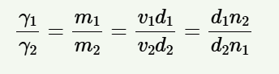
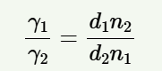

### **Introduction**

For a liquid, surface tension is defined as the force acting at right angles to the line of length one centimeter drawn on the surface of the liquid. It is usually represented by the Greek letter γ and its unit is dynes/cm. The surface tension may be measured relative to the pure liquid by using a stalagmometer, which operates on the “drop weight” principle. Stalagmometer has a bulb with an attached capillary and marks on both sides of the capillary. Suck the volume of liquid up to the upper mark and allow it to release drop-wise up to the lower mark. In this manner, the volume of liquid is fixed. The size of the drop forming at the end of the capillary depends upon the surface tension of the liquid. The drop falls when the total surface force (i.e., 2πrγ) of the drop is equal to its weight (i.e. w = mg = 2πrγ).

For liquids, 

  

Since the volume is fixed and n1 and n2 is the number of drops formed by volume v of the two liquids, their surface tensions are related as:

  

  
   <strong>Fig. 1: Working principle of stalagmometer</strong>

  
   <strong>Fig. 2: Apparatus of stalagmometer</strong>

    
   
  <strong>Fig. 3: Spherical shape of drops, surface tension on the molecules of the liquid inside the solution and on surface</strong>

### **Applications**

1.Residential Water Softening  
2.Laundry Facilities  
3.Dishwashing  
4.Boiler Feedwater Treatment  
5.Cooling Tower Water Treatment
